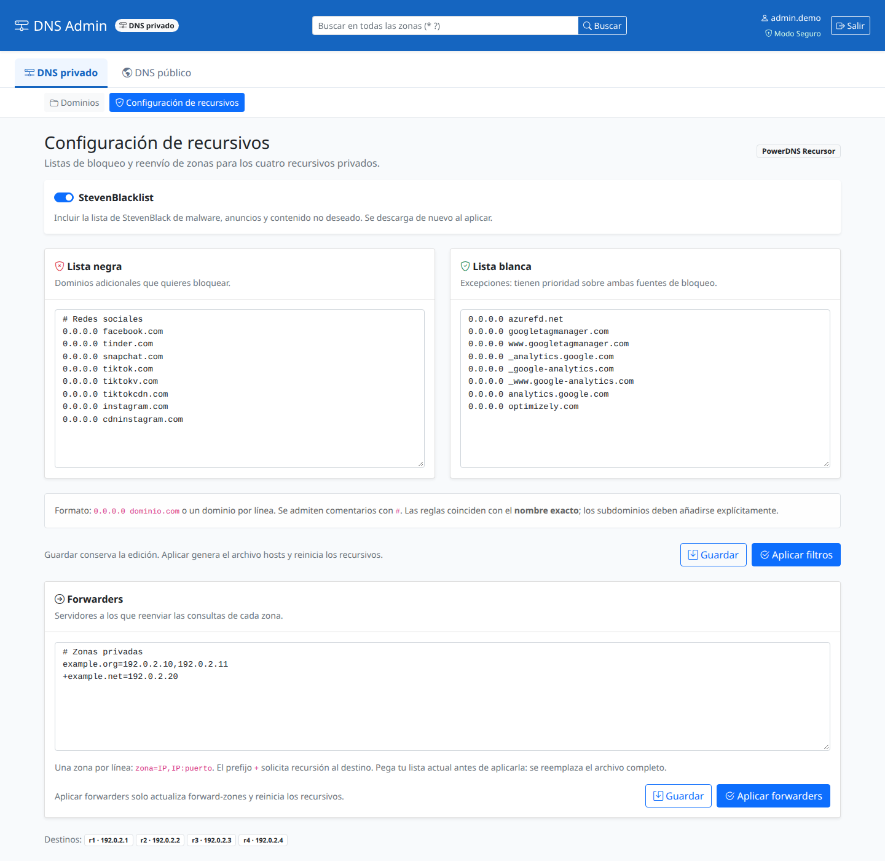

# pdnsadmin-z

Interfaz web en español para administrar zonas y registros de **PowerDNS Authoritative**. Está desarrollada con Python y Flask, permite alternar entre un servidor interno y otro de Internet e integra el acceso con **OIDC/Keycloak**.

Los cambios de registros se guardan en una lista de pendientes: puedes revisarlos, descartarlos o confirmarlos antes de enviarlos a PowerDNS.

**Sin bases de datos intermedias:** pdnsadmin-z consulta y modifica directamente los servidores PowerDNS a través de su API HTTP. No mantiene una base de datos propia de zonas o registros. Las listas de filtros de recursivos se guardan en archivos locales y se distribuyen como hosts mediante un script del sistema. Los cambios de registros pendientes se conservan temporalmente en la sesión del usuario y se envían a PowerDNS al confirmarlos; la creación y eliminación de zonas se ejecutan directamente al realizar la operación.

## Configuración de recursivos privados

En **DNS privado**, las subpestañas **Dominios** y **Configuración de recursivos** separan la administración autoritativa de las políticas de los recursivos. Filtros permite seleccionar StevenBlacklist (variante gambling-porn), editar listas negra y blanca y generar un archivo hosts y distribuirlo a cuatro PowerDNS Recursor mediante un script del sistema que copia por SCP y reinicia los servicios. También permite editar y aplicar `/etc/powerdns/forward-zones`, con un botón independiente. La aplicación no maneja credenciales SSH y muestra resultados individuales.

Consulta la [guía de configuración y despliegue de filtros](docs/recursive-filters.md) para preparar los recursivos y sus permisos. La lista blanca tiene prioridad y utiliza nombres exactos. Esta funcionalidad se desarrolla en la rama `recursor_control`.

Para instalar esta rama directamente, descarga su instalador y selecciona la misma referencia:

```sh
curl -fsSL https://raw.githubusercontent.com/lared3294/pdnsadmin-z/recursor_control/install.sh -o /tmp/pdnsadmin-install.sh
sudo bash /tmp/pdnsadmin-install.sh --ref recursor_control
```

## Capturas de pantalla

Las capturas se generaron a partir de las plantillas reales del proyecto con un usuario, dominios y direcciones ficticios.

**Registros de una zona**, con controles de edición y un cambio pendiente:


**Revisión de cambios**, antes de confirmar su aplicación:


**Configuración de recursivos**, con listas de bloqueo y forwarders editables:



## Funcionalidades

- Selección de servidor **DNS privado** o **DNS público**, cada uno con su URL y clave API.
- Consulta de zonas y sus conjuntos de registros (RRsets).
- Búsqueda global en el servidor seleccionado, con comodines `*` y `?`.
- Alta, modificación y borrado de registros con revisión previa.
- Edición de varios valores dentro de un mismo RRset.
- Creación y eliminación de zonas en **Modo Kamikaze**.
- Usuarios administradores o de consulta, según los grupos recibidos por OIDC.
- Sesiones almacenadas en el servidor, protección CSRF y registro de eventos en syslog.

El backend admite `A`, `AAAA`, `CNAME`, `MX`, `TXT`, `NS`, `SOA`, `PTR`, `SRV` y `CAA`. El formulario de alta ofrece `A`, `CNAME`, `MX`, `TXT` y `NS`; los demás tipos existentes pueden consultarse y editarse desde la tabla, con las restricciones del SOA descritas más abajo.

## Requisitos

- Python 3 con soporte para entornos virtuales y `pip`.
- Un servidor PowerDNS Authoritative con su API HTTP habilitada; dos si deseas separar DNS interno y de Internet.
- Un proveedor OIDC. La integración y el cierre de sesión están orientados a Keycloak.
- Para producción: Gunicorn y un proxy inverso con HTTPS, por ejemplo Nginx.

**No hay usuarios ni contraseñas locales.** El archivo de ejemplo deja OIDC deshabilitado para que configures tu proveedor; en ese estado se muestra una advertencia y no se puede iniciar sesión en el panel.

## Instalación automática (recomendada)

Puedes instalar sin Git ni clonar el repositorio, usando `curl` y Bash:

```sh
curl -fsSL https://raw.githubusercontent.com/lared3294/pdnsadmin-z/main/install.sh | sudo bash -s --
sudoedit /etc/pdnsadmin/config.ini
```

El script descarga el proyecto por HTTPS en un directorio temporal, instala los archivos y limpia la descarga al terminar. Necesitas `curl` y `tar` para ese primer paso; Git no es necesario.

Para previsualizar desde `curl`:

```sh
curl -fsSL https://raw.githubusercontent.com/lared3294/pdnsadmin-z/main/install.sh | bash -s -- --dry-run
```

También puedes descargar primero el script para revisarlo y ejecutarlo después:

```sh
curl -fsSL https://raw.githubusercontent.com/lared3294/pdnsadmin-z/main/install.sh -o install.sh
sudo bash install.sh
```

Si ya tienes el proyecto completo, ejecuta el instalador desde su carpeta:

```sh
git clone https://github.com/lared3294/pdnsadmin-z.git
cd pdnsadmin-z
./install.sh --dry-run
sudo ./install.sh
sudoedit /etc/pdnsadmin/config.ini
```

Si no tienes `git`, puedes descargar y descomprimir el repositorio desde GitHub. El instalador requiere Bash y Linux. Si se ejecuta sin una copia completa del proyecto, la descarga automáticamente.

El instalador:

- Detecta systemd en ejecución o SysV con su herramienta de registro.
- Instala Python, soporte para entornos virtuales y los paquetes auxiliares mediante `apt-get`, `dnf`, `yum` o `zypper`.
- Copia solo el código y las plantillas a `/opt/pdnsadmin-z`: no copia tu INI local, certificados, claves, ZIPs ni `.git`.
- Crea `.venv`, instala `requirements.txt` y comprueba las dependencias con `pip check`.
- Crea el usuario y grupo de sistema **`pdnsadmin`**, sin login interactivo.
- Prepara `/etc/pdnsadmin/config.ini` con permisos `0640`, una clave de sesión aleatoria y sesiones persistentes en `/var/lib/pdnsadmin/sessions`.
- Prepara `/etc/pdnsadmin/certs` para los certificados de un despliegue con TLS directo.
- Instala el servicio apropiado y guarda una copia de respaldo si ya existía su archivo.

**En una instalación nueva, el servicio queda sin iniciar ni habilitar.** Primero completa las URLs y claves de PowerDNS, OIDC/Keycloak, dirección de escucha y TLS. La configuración nueva tiene OIDC deshabilitado hasta que la edites. Las URLs de PowerDNS generadas usan `localhost` como identificador de ejemplo, con puertos `8081` y `8082`; adáptalas a tus instancias.

Para validar la configuración y sus permisos como usuario del servicio:

```sh
sudo runuser -u pdnsadmin -- sh -c 'cd /opt/pdnsadmin-z && DNSADMIN_CONFIG=/etc/pdnsadmin/config.ini .venv/bin/gunicorn --config gunicorn.conf.py --check-config wsgi:app'
```

Esta comprobación valida el arranque y TLS; no prueba las credenciales ni la conectividad con PowerDNS y Keycloak. Si instalas certificados, hazlos legibles por el grupo `pdnsadmin`, por ejemplo:

```sh
sudo install -o root -g pdnsadmin -m 0640 fullchain.pem /etc/pdnsadmin/certs/fullchain.pem
sudo install -o root -g pdnsadmin -m 0640 privkey.pem /etc/pdnsadmin/certs/privkey.pem
```

Después de configurar, en **systemd**:

```sh
sudo systemctl enable --now pdnsadmin
sudo systemctl status pdnsadmin
sudo journalctl -u pdnsadmin -f
```

En **SysV de Devuan/antiX**:

```sh
sudo update-rc.d pdnsadmin enable
sudo service pdnsadmin start
sudo service pdnsadmin status
```

Si el sistema usa `chkconfig`, habilita con `sudo chkconfig pdnsadmin on`. SysV requiere `start-stop-daemon` y `runuser`; el instalador prepara esos componentes en Devuan/antiX y comprueba su presencia en las demás distribuciones.

### Opciones y reinstalación

```sh
./install.sh --help
./install.sh --dry-run --init systemd
sudo ./install.sh --init sysv
sudo ./install.sh --no-packages
```

`--dry-run` muestra los comandos de instalación sin ejecutarlos y no requiere privilegios. Si falta el proyecto local, descarga y extrae una copia temporal para preparar la simulación. `--ref` permite elegir la rama, etiqueta o commit que se descarga (por defecto `main`); se usa cuando falta una copia local completa. `--init` permite elegir explícitamente el gestor, por ejemplo al preparar una máquina sin un init activo. `--no-packages` omite el gestor de paquetes del sistema, comprueba las herramientas existentes e instala igualmente las dependencias Python dentro de `.venv`.

En reinstalaciones, el INI existente **se conserva byte por byte**; no se regenera la clave de sesión ni se añaden opciones automáticamente. Sus permisos se ajustan al usuario del instalador. El código, las dependencias y el archivo de servicio se actualizan; cualquier personalización de ese archivo queda en una copia `.bak.FECHA.PID`. Reaplica después tus cambios o usa un override de systemd. Una habilitación previa de systemd se conserva, aunque el instalador no ejecuta el arranque.

Detén `pdnsadmin` y el antiguo `dnsadmin`, si corresponde, antes de actualizar. El instalador rechaza reemplazar una instancia activa que detecta. Si migras desde una instalación manual con `www-data`, revisa que el nuevo usuario `pdnsadmin` pueda leer los certificados y escribir el directorio de sesiones que conserva tu INI.

## Instalación manual

### 1. Descargar y preparar Python

```sh
git clone https://github.com/lared3294/pdnsadmin-z.git
cd pdnsadmin-z
python3 -m venv .venv
. .venv/bin/activate
python -m pip install -r requirements.txt
cp config.example.ini config.ini
chmod 600 config.ini
```

`requirements.txt` incluye `cachelib` para las sesiones y `gunicorn` para el servidor WSGI.

En Debian/Ubuntu, si falta el módulo `venv`, instala los paquetes `python3-venv` y `python3-pip` antes de crear el entorno.

### 2. Conectar PowerDNS

En el servidor PowerDNS, un ejemplo para una API accesible desde la misma máquina es:

```ini
# pdns.conf
api=yes
api-key=REEMPLAZAR_POR_UNA_CLAVE_SEGURA
webserver=yes
webserver-address=127.0.0.1
webserver-port=8081
webserver-allow-from=127.0.0.1
```

Reinicia PowerDNS después de adaptar su configuración. Si la aplicación se ejecuta en otra máquina, ajusta la dirección y la ACL para permitir el acceso desde esa máquina. Consulta la [documentación de la API de PowerDNS](https://doc.powerdns.com/authoritative/http-api/index.html) para los detalles del servidor web y la autenticación.

En `config.ini`, configura la URL base **hasta el identificador del servidor**, sin añadir `/zones`:

```ini
[pdns]
url_internal = http://127.0.0.1:8081/api/v1/servers/localhost
key_internal = REEMPLAZAR_POR_LA_CLAVE_API_INTERNA
url_external = http://127.0.0.1:8082/api/v1/servers/localhost
key_external = REEMPLAZAR_POR_LA_CLAVE_API_EXTERNA
default_zone_kind = Master
default_nameservers = ns1.example.org., ns2.example.org.
search_max = 500
```

`internal` y `external` son etiquetas de la aplicación; no tienen que ser los identificadores de la API. Sustituye `localhost` por el identificador real que devuelve tu servidor. El puerto `8082` es solo un ejemplo de una segunda instancia. Si dispones de una sola instancia, puedes configurar ambas entradas con la misma URL y clave; ambas pestañas mostrarán los mismos datos.

### 3. Configurar sesiones

Genera una clave de sesión:

```sh
python -c 'import secrets; print(secrets.token_hex(32))'
```

Copia el resultado en `config.ini`:

```ini
[flask]
secret_key = REEMPLAZAR_POR_LA_CLAVE_GENERADA
session_secure = True
trust_proxy = False
proxy_hops = 1
session_file_dir = /tmp/flask_sessions
```

Mantén la clave entre reinicios y compártela entre los workers. El directorio de sesiones debe ser escribible por el usuario que ejecuta Gunicorn y compartido entre sus workers. La duración configurada de las sesiones es de una hora; los cambios pendientes pertenecen a la sesión del usuario.

### 4. Configurar Keycloak / OIDC

En Keycloak, prepara un cliente OpenID Connect con **Standard Flow** y autenticación del cliente habilitados. Registra la URI de retorno de la aplicación y configura un mapper de pertenencia a grupos para que estos estén presentes en los datos de usuario recibidos por la aplicación. La configuración del proveedor se describe en la [guía de administración de Keycloak](https://www.keycloak.org/docs/latest/server_admin/index.html).

Ejemplo para una aplicación publicada en `https://dnsadmin.example.org`:

```ini
[oidc]
enabled = True
issuer = https://sso.example.org/realms/example
client_id = pdnsadmin-z
client_secret = REEMPLAZAR_POR_EL_SECRETO_DEL_CLIENTE
admin_role = AdminDNSUsers
user_role = DNSUsers
groups_claim = Grupos
verify_ssl = True
redirect_uri = https://dnsadmin.example.org/callback
```

- **Valid redirect URI:** `https://dnsadmin.example.org/callback`.
- **Valid post logout redirect URI:** `https://dnsadmin.example.org/login`.
- **Grupo `AdminDNSUsers`:** acceso de administración.
- **Grupo `DNSUsers`:** acceso de consulta.
- **Claim `Grupos`:** lista de grupos del usuario; puedes cambiar `groups_claim` si tu proveedor usa otro nombre. El código también acepta el claim `groups` como alternativa.

La aplicación acepta los nombres de grupo con o sin `/` inicial. Si el usuario pertenece a ambos grupos, se le asigna administración; si no pertenece a ninguno, se rechaza el acceso. Los roles configurados aquí se comparan con **grupos**, no directamente con `realm_access.roles`.

## Puesta en marcha

Desde la carpeta del proyecto, con el entorno virtual activado:

```sh
gunicorn --config gunicorn.conf.py wsgi:app
```

Para una prueba local por HTTP, cambia temporalmente `session_secure = False`, usa `http://127.0.0.1:5000/callback` como `redirect_uri` y registra esa misma URI en Keycloak. Registra también `http://127.0.0.1:5000/login` para el retorno del cierre de sesión. Abre `http://127.0.0.1:5000` en el navegador. En producción, vuelve a `session_secure = True` y usa HTTPS.

### HTTPS con Nginx

Con Gunicorn escuchando en `127.0.0.1:5000`, este bloque ilustra el proxy inverso. Sustituye el dominio y las rutas de certificados por los de tu entorno:

```nginx
server {
    listen 443 ssl;
    server_name dnsadmin.example.org;

    ssl_certificate /etc/letsencrypt/live/dnsadmin.example.org/fullchain.pem;
    ssl_certificate_key /etc/letsencrypt/live/dnsadmin.example.org/privkey.pem;

    location / {
        proxy_pass http://127.0.0.1:5000;
        proxy_set_header Host $host;
        proxy_set_header X-Forwarded-For $proxy_add_x_forwarded_for;
        proxy_set_header X-Forwarded-Proto $scheme;
    }
}
```

Para ese despliegue con un único proxy confiable, configura `trust_proxy = True`, `proxy_hops = 1` y `session_secure = True`. Gunicorn debe ser accesible a través del proxy confiable para que las cabeceras reenviadas representen correctamente el host y el esquema HTTPS.

### HTTPS directo desde Gunicorn

Si Gunicorn termina TLS, configura el INI así:

```ini
[server]
bind = 0.0.0.0:8443
workers = 3

[tls]
enabled = True
certfile = /etc/pdnsadmin/certs/fullchain.pem
keyfile = /etc/pdnsadmin/certs/privkey.pem
```

Configura también `session_secure = True` y una URI OIDC que coincida con la dirección pública, por ejemplo `https://dnsadmin.example.org:8443/callback`. Usa `trust_proxy = False` si el navegador conecta directamente a Gunicorn.

Las rutas relativas de certificados se resuelven desde la carpeta del **archivo INI**, no desde el directorio de trabajo. El certificado puede incluir la cadena intermedia; la clave debe estar sin contraseña y ambos archivos deben ser legibles por el usuario del servicio. Al arrancar se comprueba que se puedan cargar y que el certificado corresponda a la clave. Si falla la validación, el proceso se detiene con un error; no pasa a HTTP silenciosamente. Esta comprobación no sustituye verificar vigencia, nombre de dominio y confianza de la cadena.

Si Nginx termina HTTPS, usa `[tls] enabled = False` y `[server] bind = 127.0.0.1:5000`; los certificados se configuran en Nginx. `session_secure = True` se mantiene para el acceso del navegador por HTTPS.

El puerto `8443` permite ejecutar el servicio sin privilegios de root. Para servir en `443`, utiliza un proxy inverso o adapta los permisos de acceso a puertos privilegiados de tu sistema.

## Instalar manualmente el servicio pdnsadmin

Estos ejemplos manuales usan `www-data`; el instalador automático adapta el servicio para usar la cuenta dedicada `pdnsadmin` y sesiones persistentes. La unidad systemd y el script SysV de los ejemplos comparten estas ubicaciones:

| Elemento | Ubicación |
| --- | --- |
| Aplicación y entorno virtual | `/opt/pdnsadmin-z` y `/opt/pdnsadmin-z/.venv` |
| Configuración | `/etc/pdnsadmin/config.ini` |
| Usuario y grupo del servicio | `www-data` |
| Sesiones recomendadas | `/run/pdnsadmin/sessions` |

Los comandos siguientes sirven como ejemplo para sistemas basados en Debian: Debian/Ubuntu con systemd y Devuan/antiX con SysV. En otras distribuciones adapta el usuario/grupo, el gestor de paquetes y las rutas. No instales el mismo servicio simultáneamente con systemd y SysV.

### Preparar la instalación

```sh
sudo apt install python3-venv python3-pip git
sudo git clone https://github.com/lared3294/pdnsadmin-z.git /opt/pdnsadmin-z
sudo python3 -m venv /opt/pdnsadmin-z/.venv
sudo /opt/pdnsadmin-z/.venv/bin/python -m pip install -r /opt/pdnsadmin-z/requirements.txt
sudo install -d -o root -g www-data -m 0750 /etc/pdnsadmin
sudo install -o root -g www-data -m 0640 /opt/pdnsadmin-z/config.example.ini /etc/pdnsadmin/config.ini
sudoedit /etc/pdnsadmin/config.ini
```

Si `/opt/pdnsadmin-z` ya contiene tu instalación, conserva ese directorio y omite el clon. Completa PowerDNS, OIDC, la clave de sesión, `[server]` y `[tls]` según los apartados anteriores. Para las sesiones, establece:

```ini
[flask]
# Conservar aquí también secret_key y el resto de las opciones del despliegue.
session_file_dir = /run/pdnsadmin/sessions
```

Con TLS directo, instala los certificados en las rutas configuradas. Por ejemplo, desde la carpeta que contiene tus archivos:

```sh
sudo install -d -o root -g www-data -m 0750 /etc/pdnsadmin/certs
sudo install -o root -g www-data -m 0640 fullchain.pem /etc/pdnsadmin/certs/fullchain.pem
sudo install -o root -g www-data -m 0640 privkey.pem /etc/pdnsadmin/certs/privkey.pem
```

El usuario `www-data` necesita lectura del código, del INI y de los certificados, y escritura del directorio de sesiones. Conserva el código y el entorno virtual bajo propiedad de root. Si usas enlaces a certificados gestionados por otra herramienta, comprueba también permisos de sus directorios de destino.

### Sistemas con systemd

```sh
sudo install -m 0644 /opt/pdnsadmin-z/systemd/pdnsadmin.service /etc/systemd/system/pdnsadmin.service
sudo systemctl daemon-reload
sudo systemctl enable --now pdnsadmin
sudo systemctl status pdnsadmin
```

La unidad crea `/run/pdnsadmin`, ejecuta Gunicorn en primer plano con el usuario `www-data`, envía su salida al journal y reinicia el proceso si falla. Para consultar logs y administrar el servicio:

```sh
sudo journalctl -u pdnsadmin -f
sudo systemctl reload pdnsadmin
sudo systemctl restart pdnsadmin
sudo systemctl stop pdnsadmin
```

`reload` valida la configuración antes de enviar HUP a Gunicorn. Cambios de dirección o de modo TLS deben aplicarse mediante `restart`. Tras renovar certificados en las mismas rutas, usa `reload`. Los eventos de auditoría de la aplicación siguen enviándose a syslog con el nombre `pdnsadmin`.

Para otra ruta de instalación o usuario, edita la unidad con `sudo systemctl edit --full pdnsadmin`, ajusta `User`, `Group`, `WorkingDirectory`, `Environment`, `ExecStart` y `ExecReload`, y luego recarga systemd y reinicia el servicio. La [documentación de Gunicorn](https://gunicorn.org/configure/) describe la carga y validación de su configuración.

### Sistemas con SysV init (Devuan / antiX)

El script `init/pdnsadmin` usan las mismas rutas y configuración. Revisa sus variables iniciales si tu instalación es distinta. Requieren `start-stop-daemon` y `runuser`.

```sh
sudo install -m 0755 /opt/pdnsadmin-z/init/pdnsadmin /etc/init.d/pdnsadmin
sudo update-rc.d pdnsadmin defaults
sudo service pdnsadmin start
sudo service pdnsadmin status
```

El script crea los directorios de ejecución y logs, comprueba la configuración como usuario del servicio y arranca Gunicorn. Los logs de Gunicorn quedan en `/var/log/pdnsadmin/access.log` y `/var/log/pdnsadmin/error.log`.

```sh
sudo service pdnsadmin reload
sudo service pdnsadmin restart
sudo /etc/init.d/pdnsadmin tail
```

### Migrar desde el servicio dnsadmin

Antes de habilitar `pdnsadmin`, detén y deshabilita el servicio anterior para evitar dos instancias escuchando en el mismo puerto. En systemd:

```sh
sudo systemctl disable --now dnsadmin
```

En SysV init de Devuan/antiX:

```sh
sudo service dnsadmin stop
sudo update-rc.d dnsadmin disable
```

Copia las rutas de certificados y la dirección de escucha de tu antiguo script al nuevo INI. Cambia también rutas de automatizaciones o comandos que todavía invoquen el servicio anterior.

`/run` es temporal: las sesiones allí se pierden al reiniciar el equipo o detener el servicio systemd. Aplica o descarta los cambios pendientes antes de esas operaciones. Si necesitas conservarlas, configura un directorio persistente y crea sus permisos para el usuario del servicio.

## Uso del panel

### Consultar y buscar

1. Abre la aplicación e inicia sesión mediante Keycloak.
2. Selecciona **DNS privado** o **DNS público**. La cabecera cambia de color para identificar el servidor activo.
3. Haz clic en una zona para consultar nombres, tipos, TTL y valores.
4. Usa la búsqueda de la cabecera para localizar registros en todas las zonas del servidor seleccionado. Por ejemplo, `www*` o `*example.org*`.

Las consultas de búsqueda tienen entre 2 y 100 caracteres y muestran hasta `search_max` resultados (500 por defecto). La búsqueda depende de que el backend de PowerDNS soporte `/search-data`.

### Crear, modificar o borrar registros

1. Como administrador, abre una zona y pulsa **Añadir registro** para desplegar el formulario. Introduce el nombre relativo (`www`) o `@` para la raíz de la zona, tipo, contenido y TTL en segundos.
2. Pulsa **Guardar**, o **Modificar** sobre un RRset existente. Para varios valores del mismo nombre y tipo, usa **Modificar** y edita la lista completa.
3. Abre **Revisar cambios** en la cabecera para revisar el servidor, zona, nombre, tipo, TTL y contenido.
4. Quita un cambio individual, usa **Descartar Todo**, o pulsa **Confirmar y Aplicar** para enviarlos a PowerDNS.

Ejemplo: en `example.org.`, el nombre `www`, tipo `A`, contenido `192.0.2.20` y TTL `300` prepara un cambio para `www.example.org.`. Para MX, el contenido tiene prioridad y destino, por ejemplo `10 mail.example.org.`.

Una modificación reemplaza el **RRset completo** (el conjunto de valores con el mismo nombre y tipo). El botón de borrado también elimina ese conjunto completo. Revisa todos los valores antes de confirmar.

Hay un máximo de **10 cambios pendientes** y **20 valores por RRset**. Al aplicar, los cambios se agrupan por servidor y zona. Si una zona falla, sus cambios permanecen pendientes; los que se aplicaron correctamente se retiran. La operación entre distintas zonas o servidores no es una transacción global.

### Modo Seguro y Modo Kamikaze

| Modo | Operaciones disponibles para administradores |
| --- | --- |
| Seguro (por defecto) | Consultar y preparar cambios de registros; el SOA queda bloqueado. |
| Kamikaze | También crear y eliminar zonas, y modificar el SOA existente. |

**Crear y borrar zonas se ejecuta inmediatamente**, fuera de la lista de cambios pendientes. Para borrar una zona debes escribir su nombre como confirmación. El SOA solo puede existir en la raíz de la zona y no se puede borrar desde la interfaz.

Los usuarios de consulta pueden navegar y buscar, pero no modificar DNS.

## Archivo de configuración y variables de entorno

Por defecto se lee `config.ini` en el directorio de trabajo. Para utilizar otra ubicación:

```sh
export DNSADMIN_CONFIG=/etc/pdnsadmin/config.ini
gunicorn --config gunicorn.conf.py wsgi:app
```

La prioridad es **archivo INI → variable de entorno → valor por defecto**. Una opción presente en el archivo, incluso vacía, prevalece sobre su variable de entorno. Si quieres usar variables para secretos, elimina las opciones correspondientes del INI.

| Opción INI | Variable de entorno |
| --- | --- |
| `[server] bind` / `workers` | `PDNSADMIN_BIND` / `PDNSADMIN_WORKERS` |
| `[tls] enabled` | `PDNSADMIN_TLS_ENABLED` |
| `[tls] certfile` / `keyfile` | `PDNSADMIN_TLS_CERTFILE` / `PDNSADMIN_TLS_KEYFILE` |
| `[pdns] url_internal` / `key_internal` | `PDNS_API_URL_INTERNAL` / `PDNS_API_KEY_INTERNAL` |
| `[pdns] url_external` / `key_external` | `PDNS_API_URL_EXTERNAL` / `PDNS_API_KEY_EXTERNAL` |
| `[pdns] default_zone_kind` / `default_nameservers` | `DEFAULT_ZONE_KIND` / `DEFAULT_ZONE_NAMESERVERS` |
| `[pdns] search_max` | `PDNS_SEARCH_MAX` |
| `[flask] secret_key` / `session_secure` | `FLASK_SECRET_KEY` / `SESSION_SECURE` |
| `[flask] trust_proxy` / `proxy_hops` | `TRUST_PROXY` / `PROXY_HOPS` |
| `[flask] session_file_dir` | `SESSION_FILE_DIR` |
| `[oidc] enabled` / `issuer` | `OIDC_ENABLED` / `OIDC_ISSUER` |
| `[oidc] client_id` / `client_secret` | `OIDC_CLIENT_ID` / `OIDC_CLIENT_SECRET` |
| `[oidc] admin_role` / `user_role` | `OIDC_ADMIN_ROLE` / `OIDC_USER_ROLE` |
| `[oidc] groups_claim` / `redirect_uri` | `OIDC_GROUPS_CLAIM` / `OIDC_REDIRECT_URI` |
| `[oidc] verify_ssl` | `OIDC_VERIFY_SSL` |

## Problemas frecuentes

| Síntoma | Qué revisar |
| --- | --- |
| `ModuleNotFoundError: cachelib` | Activa `.venv` e instala `requirements.txt`. |
| «La autenticación OIDC no está habilitada» | Establece `[oidc] enabled = True` y completa los datos del cliente. |
| «No tienes permiso para acceder a esta aplicación» | Comprueba grupos del usuario y el mapper del claim `Grupos` o el configurado. |
| Error de conexión o timeout de PowerDNS | Comprueba URL, puerto, conectividad y ACL del servidor web. |
| Error de API / autorización | Revisa el identificador del servidor y que la clave coincida con `api-key`. |
| Bucle de login o error CSRF en una prueba HTTP | Revisa `session_secure`, la URI de retorno y que el navegador conserve la cookie. |
| URI de retorno incorrecta detrás del proxy | Revisa `redirect_uri`, `trust_proxy`, `proxy_hops` y las cabeceras reenviadas. |
| Error TLS al iniciar el servicio | Revisa `certfile`, `keyfile`, permisos del usuario del servicio y que el certificado corresponda a la clave sin contraseña. |
| Error al escribir sesiones | Revisa permisos y ubicación de `session_file_dir` para el usuario de Gunicorn. |
| No aparecen estilos o iconos | El navegador necesita acceder a `cdn.jsdelivr.net`, usado por las plantillas. |

Los eventos se envían a syslog con el nombre `pdnsadmin`: revisa el destino de syslog de tu sistema para diagnosticar accesos y operaciones. `config.ini`, archivos `.pem`, claves `.key` y archivos ZIP están excluidos de Git; guarda los secretos y certificados fuera del repositorio.
