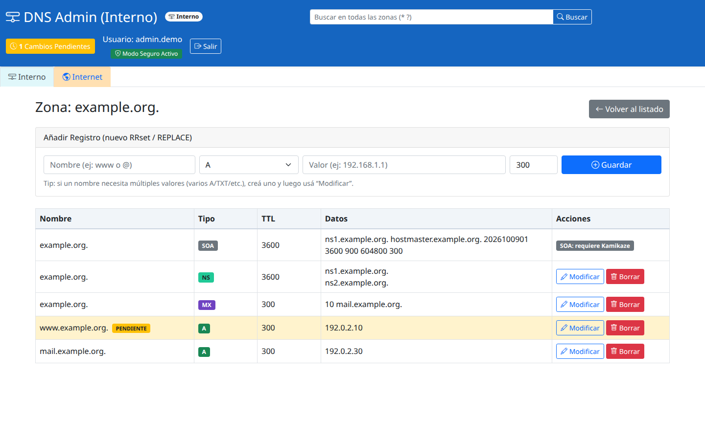
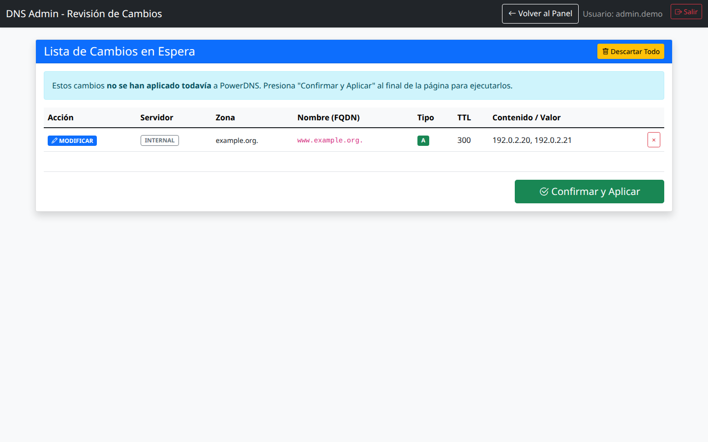

# pdnsadmin-z

Interfaz web en español para administrar zonas y registros de **PowerDNS Authoritative**. Está desarrollada con Python y Flask, permite alternar entre un servidor interno y otro de Internet e integra el acceso con **OIDC/Keycloak**.

Los cambios de registros se guardan en una lista de pendientes: puedes revisarlos, descartarlos o confirmarlos antes de enviarlos a PowerDNS.

## Capturas de pantalla

Las capturas se generaron a partir de las plantillas reales del proyecto con un usuario, dominios y direcciones ficticios.

**Registros de una zona**, con controles de edición y un cambio pendiente:



**Revisión de cambios**, antes de confirmar su aplicación:



## Funcionalidades

- Selección de servidor **Interno** o **Internet**, cada uno con su URL y clave API.
- Consulta de zonas y sus conjuntos de registros (RRsets).
- Búsqueda global en el servidor seleccionado, con comodines `*` y `?`.
- Alta, modificación y borrado de registros con revisión previa.
- Edición de varios valores dentro de un mismo RRset.
- Creación y eliminación de zonas en **Modo Kamikaze**.
- Usuarios administradores o de consulta, según los grupos recibidos por OIDC.
- Sesiones almacenadas en el servidor, protección CSRF y registro de eventos en syslog.

El backend admite `A`, `AAAA`, `CNAME`, `MX`, `TXT`, `NS`, `SOA`, `PTR`, `SRV` y `CAA`. El formulario de alta ofrece `A`, `CNAME`, `MX`, `TXT` y `NS`; los demás tipos existentes pueden consultarse y editarse desde la tabla, con las restricciones del SOA descritas más abajo.

## Requisitos

- Python 3 con soporte para entornos virtuales y `pip`.
- Un servidor PowerDNS Authoritative con su API HTTP habilitada; dos si deseas separar DNS interno y de Internet.
- Un proveedor OIDC. La integración y el cierre de sesión están orientados a Keycloak.
- Para producción: Gunicorn y un proxy inverso con HTTPS, por ejemplo Nginx.

**No hay usuarios ni contraseñas locales.** El archivo de ejemplo deja OIDC deshabilitado para que configures tu proveedor; en ese estado se muestra una advertencia y no se puede iniciar sesión en el panel.

## Instalación

### 1. Descargar y preparar Python

```sh
git clone https://github.com/lared3294/pdnsadmin-z.git
cd pdnsadmin-z
python3 -m venv .venv
. .venv/bin/activate
python -m pip install -r requirements.txt
python -m pip install cachelib gunicorn
cp config.example.ini config.ini
chmod 600 config.ini
```

`cachelib` es necesario para las sesiones y `gunicorn` para el servidor WSGI; actualmente se instalan por separado porque no están incluidos en `requirements.txt`.

En Debian/Ubuntu, si falta el módulo `venv`, instala los paquetes `python3-venv` y `python3-pip` antes de crear el entorno.

### 2. Conectar PowerDNS

En el servidor PowerDNS, un ejemplo para una API accesible desde la misma máquina es:

```ini
# pdns.conf
api=yes
api-key=REEMPLAZAR_POR_UNA_CLAVE_SEGURA
webserver=yes
webserver-address=127.0.0.1
webserver-port=8081
webserver-allow-from=127.0.0.1
```

Reinicia PowerDNS después de adaptar su configuración. Si la aplicación se ejecuta en otra máquina, ajusta la dirección y la ACL para permitir el acceso desde esa máquina. Consulta la [documentación de la API de PowerDNS](https://doc.powerdns.com/authoritative/http-api/index.html) para los detalles del servidor web y la autenticación.

En `config.ini`, configura la URL base **hasta el identificador del servidor**, sin añadir `/zones`:

```ini
[pdns]
url_internal = http://127.0.0.1:8081/api/v1/servers/localhost
key_internal = REEMPLAZAR_POR_LA_CLAVE_API_INTERNA
url_external = http://127.0.0.1:8082/api/v1/servers/localhost
key_external = REEMPLAZAR_POR_LA_CLAVE_API_EXTERNA
default_zone_kind = Master
default_nameservers = ns1.example.org., ns2.example.org.
search_max = 500
```

`internal` y `external` son etiquetas de la aplicación; no tienen que ser los identificadores de la API. Sustituye `localhost` por el identificador real que devuelve tu servidor. El puerto `8082` es solo un ejemplo de una segunda instancia. Si dispones de una sola instancia, puedes configurar ambas entradas con la misma URL y clave; ambas pestañas mostrarán los mismos datos.

### 3. Configurar sesiones

Genera una clave de sesión:

```sh
python -c 'import secrets; print(secrets.token_hex(32))'
```

Copia el resultado en `config.ini`:

```ini
[flask]
secret_key = REEMPLAZAR_POR_LA_CLAVE_GENERADA
session_secure = True
trust_proxy = False
proxy_hops = 1
session_file_dir = /tmp/flask_sessions
```

Mantén la clave entre reinicios y compártela entre los workers. El directorio de sesiones debe ser escribible por el usuario que ejecuta Gunicorn y compartido entre sus workers. La duración configurada de las sesiones es de una hora; los cambios pendientes pertenecen a la sesión del usuario.

### 4. Configurar Keycloak / OIDC

En Keycloak, prepara un cliente OpenID Connect con **Standard Flow** y autenticación del cliente habilitados. Registra la URI de retorno de la aplicación y configura un mapper de pertenencia a grupos para que estos estén presentes en los datos de usuario recibidos por la aplicación. La configuración del proveedor se describe en la [guía de administración de Keycloak](https://www.keycloak.org/docs/latest/server_admin/index.html).

Ejemplo para una aplicación publicada en `https://dnsadmin.example.org`:

```ini
[oidc]
enabled = True
issuer = https://sso.example.org/realms/example
client_id = pdnsadmin-z
client_secret = REEMPLAZAR_POR_EL_SECRETO_DEL_CLIENTE
admin_role = AdminDNSUsers
user_role = DNSUsers
groups_claim = Grupos
verify_ssl = True
redirect_uri = https://dnsadmin.example.org/callback
```

- **Valid redirect URI:** `https://dnsadmin.example.org/callback`.
- **Valid post logout redirect URI:** `https://dnsadmin.example.org/login`.
- **Grupo `AdminDNSUsers`:** acceso de administración.
- **Grupo `DNSUsers`:** acceso de consulta.
- **Claim `Grupos`:** lista de grupos del usuario; puedes cambiar `groups_claim` si tu proveedor usa otro nombre. El código también acepta el claim `groups` como alternativa.

La aplicación acepta los nombres de grupo con o sin `/` inicial. Si el usuario pertenece a ambos grupos, se le asigna administración; si no pertenece a ninguno, se rechaza el acceso. Los roles configurados aquí se comparan con **grupos**, no directamente con `realm_access.roles`.

## Puesta en marcha

Desde la carpeta del proyecto, con el entorno virtual activado:

```sh
gunicorn --workers 3 --bind 127.0.0.1:5000 wsgi:app
```

Para una prueba local por HTTP, cambia temporalmente `session_secure = False`, usa `http://127.0.0.1:5000/callback` como `redirect_uri` y registra esa misma URI en Keycloak. Registra también `http://127.0.0.1:5000/login` para el retorno del cierre de sesión. Abre `http://127.0.0.1:5000` en el navegador. En producción, vuelve a `session_secure = True` y usa HTTPS.

### HTTPS con Nginx

Con Gunicorn escuchando en `127.0.0.1:5000`, este bloque ilustra el proxy inverso. Sustituye el dominio y las rutas de certificados por los de tu entorno:

```nginx
server {
    listen 443 ssl;
    server_name dnsadmin.example.org;

    ssl_certificate /etc/letsencrypt/live/dnsadmin.example.org/fullchain.pem;
    ssl_certificate_key /etc/letsencrypt/live/dnsadmin.example.org/privkey.pem;

    location / {
        proxy_pass http://127.0.0.1:5000;
        proxy_set_header Host $host;
        proxy_set_header X-Forwarded-For $proxy_add_x_forwarded_for;
        proxy_set_header X-Forwarded-Proto $scheme;
    }
}
```

Para ese despliegue con un único proxy confiable, configura `trust_proxy = True`, `proxy_hops = 1` y `session_secure = True`. Gunicorn debe ser accesible a través del proxy confiable para que las cabeceras reenviadas representen correctamente el host y el esquema HTTPS.

Los archivos `dnsadmin.init` e `init/dnsadmin` contienen ejemplos de servicios SysV. Revisa rutas, usuario, ejecutable de Gunicorn, certificados y opciones antes de instalarlos. No forman parte de la instalación automática.

## Uso del panel

### Consultar y buscar

1. Abre la aplicación e inicia sesión mediante Keycloak.
2. Selecciona **Interno** o **Internet**. La cabecera cambia de color para identificar el servidor activo.
3. Haz clic en una zona para consultar nombres, tipos, TTL y valores.
4. Usa la búsqueda de la cabecera para localizar registros en todas las zonas del servidor seleccionado. Por ejemplo, `www*` o `*example.org*`.

Las consultas de búsqueda tienen entre 2 y 100 caracteres y muestran hasta `search_max` resultados (500 por defecto). La búsqueda depende de que el backend de PowerDNS soporte `/search-data`.

### Crear, modificar o borrar registros

1. Como administrador, abre una zona. Para añadir un registro, introduce el nombre relativo (`www`) o `@` para la raíz de la zona, tipo, contenido y TTL en segundos.
2. Pulsa **Guardar**, o **Modificar** sobre un RRset existente. Para varios valores del mismo nombre y tipo, usa **Modificar** y edita la lista completa.
3. Abre **Cambios Pendientes** para revisar el servidor, zona, nombre, tipo, TTL y contenido.
4. Quita un cambio individual, usa **Descartar Todo**, o pulsa **Confirmar y Aplicar** para enviarlos a PowerDNS.

Ejemplo: en `example.org.`, el nombre `www`, tipo `A`, contenido `192.0.2.20` y TTL `300` prepara un cambio para `www.example.org.`. Para MX, el contenido tiene prioridad y destino, por ejemplo `10 mail.example.org.`.

Una modificación reemplaza el **RRset completo** (el conjunto de valores con el mismo nombre y tipo). El botón de borrado también elimina ese conjunto completo. Revisa todos los valores antes de confirmar.

Hay un máximo de **10 cambios pendientes** y **20 valores por RRset**. Al aplicar, los cambios se agrupan por servidor y zona. Si una zona falla, sus cambios permanecen pendientes; los que se aplicaron correctamente se retiran. La operación entre distintas zonas o servidores no es una transacción global.

### Modo Seguro y Modo Kamikaze

| Modo | Operaciones disponibles para administradores |
| --- | --- |
| Seguro (por defecto) | Consultar y preparar cambios de registros; el SOA queda bloqueado. |
| Kamikaze | También crear y eliminar zonas, y modificar el SOA existente. |

**Crear y borrar zonas se ejecuta inmediatamente**, fuera de la lista de cambios pendientes. Para borrar una zona debes escribir su nombre como confirmación. El SOA solo puede existir en la raíz de la zona y no se puede borrar desde la interfaz.

Los usuarios de consulta pueden navegar y buscar, pero no modificar DNS.

## Archivo de configuración y variables de entorno

Por defecto se lee `config.ini` en el directorio de trabajo. Para utilizar otra ubicación:

```sh
export DNSADMIN_CONFIG=/etc/pdnsadmin-z/config.ini
gunicorn --workers 3 --bind 127.0.0.1:5000 wsgi:app
```

La prioridad es **archivo INI → variable de entorno → valor por defecto**. Una opción presente en el archivo, incluso vacía, prevalece sobre su variable de entorno. Si quieres usar variables para secretos, elimina las opciones correspondientes del INI.

| Opción INI | Variable de entorno |
| --- | --- |
| `[pdns] url_internal` / `key_internal` | `PDNS_API_URL_INTERNAL` / `PDNS_API_KEY_INTERNAL` |
| `[pdns] url_external` / `key_external` | `PDNS_API_URL_EXTERNAL` / `PDNS_API_KEY_EXTERNAL` |
| `[pdns] default_zone_kind` / `default_nameservers` | `DEFAULT_ZONE_KIND` / `DEFAULT_ZONE_NAMESERVERS` |
| `[pdns] search_max` | `PDNS_SEARCH_MAX` |
| `[flask] secret_key` / `session_secure` | `FLASK_SECRET_KEY` / `SESSION_SECURE` |
| `[flask] trust_proxy` / `proxy_hops` | `TRUST_PROXY` / `PROXY_HOPS` |
| `[flask] session_file_dir` | `SESSION_FILE_DIR` |
| `[oidc] enabled` / `issuer` | `OIDC_ENABLED` / `OIDC_ISSUER` |
| `[oidc] client_id` / `client_secret` | `OIDC_CLIENT_ID` / `OIDC_CLIENT_SECRET` |
| `[oidc] admin_role` / `user_role` | `OIDC_ADMIN_ROLE` / `OIDC_USER_ROLE` |
| `[oidc] groups_claim` / `redirect_uri` | `OIDC_GROUPS_CLAIM` / `OIDC_REDIRECT_URI` |
| `[oidc] verify_ssl` | `OIDC_VERIFY_SSL` |

## Problemas frecuentes

| Síntoma | Qué revisar |
| --- | --- |
| `ModuleNotFoundError: cachelib` | Activa `.venv` e instala `cachelib` como indica la instalación. |
| «La autenticación OIDC no está habilitada» | Establece `[oidc] enabled = True` y completa los datos del cliente. |
| «No tienes permiso para acceder a esta aplicación» | Comprueba grupos del usuario y el mapper del claim `Grupos` o el configurado. |
| Error de conexión o timeout de PowerDNS | Comprueba URL, puerto, conectividad y ACL del servidor web. |
| Error de API / autorización | Revisa el identificador del servidor y que la clave coincida con `api-key`. |
| Bucle de login o error CSRF en una prueba HTTP | Revisa `session_secure`, la URI de retorno y que el navegador conserve la cookie. |
| URI de retorno incorrecta detrás del proxy | Revisa `redirect_uri`, `trust_proxy`, `proxy_hops` y las cabeceras reenviadas. |
| Error al escribir sesiones | Revisa permisos y ubicación de `session_file_dir` para el usuario de Gunicorn. |
| No aparecen estilos o iconos | El navegador necesita acceder a `cdn.jsdelivr.net`, usado por las plantillas. |

Los eventos se envían a syslog con el nombre `dnsadmin`: revisa el destino de syslog de tu sistema para diagnosticar accesos y operaciones. `config.ini`, archivos `.pem`, claves `.key` y archivos ZIP están excluidos de Git; guarda los secretos y certificados fuera del repositorio.
